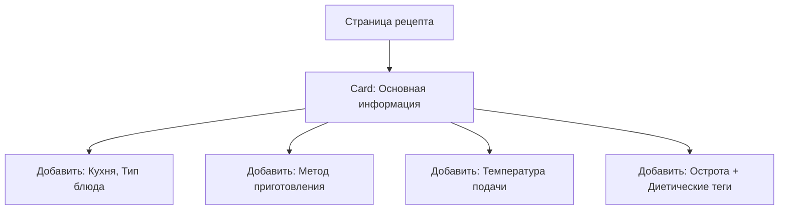

# Анализ карточки просмотра рецепта

## Цель

Проанализировать страницу просмотра рецепта ([`recipes/[id]/page.tsx`](src/app/[locale]/recipes/[id]/page.tsx:1)) на предмет неотображаемых полей и предложить визуальные улучшения UI.

---

## 1. Неотображаемые поля по типам рецептов

### 1.1 Food Recipe (Блюдо)

| Поле                  | Описание                                         | Статус             |
| --------------------- | ------------------------------------------------ | ------------------ |
| `course_type`         | Тип блюда (завтрак, обед, ужин, десерт и т.д.)   | ❌ Не отображается |
| `cuisine`             | Кухня (итальянская, японская и т.д.)             | ❌ Не отображается |
| `cooking_method`      | Метод приготовления (жарка, варка, запекание)    | ❌ Не отображается |
| `serving_temperature` | Температура подачи (горячее, холодное)           | ❌ Не отображается |
| `spicy_level`         | Уровень остроты (0-3)                            | ❌ Не отображается |
| `dietary`             | Диетические опции (веган, вегетарианское и т.д.) | ❌ Не отображается |

### 1.2 Drink Recipe (Напиток)

| Поле                  | Описание                       | Статус             |
| --------------------- | ------------------------------ | ------------------ |
| `drink_type`          | Тип напитка (чай, кофе, смузи) | ❌ Не отображается |
| `base`                | Основа (вода, молоко, сок)     | ❌ Не отображается |
| `serving_temperature` | Температура подачи             | ❌ Не отображается |
| `is_carbonated`       | Газированный (да/нет)          | ❌ Не отображается |
| `volume_ml`           | Объём в мл                     | ❌ Не отображается |
| `caffeine_mg`         | Содержание кофеина (мг)        | ❌ Не отображается |

### 1.3 Cocktail Recipe (Коктейль)

| Поле           | Описание                    | Статус             |
| -------------- | --------------------------- | ------------------ |
| `is_alcoholic` | Алкогольный/безалкогольный  | ❌ Не отображается |
| `iba_category` | Категория IBA               | ❌ Не отображается |
| `ice_type`     | Тип льда (кубики, колотый)  | ❌ Не отображается |
| `color`        | Цвет коктейля               | ❌ Не отображается |
| `garnish`      | Гарнир (украшение)          | ❌ Не отображается |
| `tools`        | Инструменты (шейкер, ложка) | ❌ Не отображается |

---

## 2. Текущая структура отображения

### 2.1 Что сейчас отображается

```
┌─────────────────────────────────────┐
│  [Badge: Тип]           ⭐ Рейтинг │
│  Заголовок рецепта                  │
│  Описание                           │
├─────────────────────────────────────┤
│  ⏱ Prep: 15мин  ⏱ Cook: 30мин      │
│  👥 4 порции     [Сложность]        │
└─────────────────────────────────────┘

┌─────────────────────────────────────┐
│  [Инструкции] [Детали]             │
├─────────────────────────────────────┤
│  Шаг 1: ...                         │
│  Шаг 2: ...                         │
│  ...                                │
└─────────────────────────────────────┘
```

### 2.2 Раздел "Детали" (текущий)

```
┌─────────────────────────────────────┐
│  Ингредиенты                         │
│  - Ингредиент 1 (100г)              │
│  - Ингредиент 2 (опционально)        │
└─────────────────────────────────────┘

┌─────────────────────────────────────┐
│  КБЖУ                               │
│  🔥 500 ккал  |  Белки 20г | Жиры  │
│  Углеводы 50г | Сахар 10г            │
└─────────────────────────────────────┘

┌─────────────────────────────────────┐
│  Коктейльные детали (только коктейли)│
│  Основа: Водка                      │
│  Метод: Встряхивание                │
│  Бокал: Мартини                     │
│  Крепость: 12%                      │
└─────────────────────────────────────┘

┌─────────────────────────────────────┐
│  Создано: Дата                      │
│  Обновлено: Дата                     │
│  [Тег1] [Тег2] [Тег3]               │
└─────────────────────────────────────┘
```

---

## 3. Рекомендации по визуальным улучшениям

### 3.1 Добавить секцию "Параметры блюда" для Food Recipe



**Рекомендуемый UI:**

```
┌─────────────────────────────────────────────┐
│  🍳 Параметры блюда                         │
├─────────────────────────────────────────────┤
│  🇮🇹 Итальянская  |  🍝 Основное блюдо       │
│  🔥 Запекание    |  ♨️ Горячее               │
├─────────────────────────────────────────────┤
│  Острота: ████░░ (2/3 - Среднеострый)       │
├─────────────────────────────────────────────┤
│  🥬 Веганское  |  🥛 Без глютена  |   ...
└─────────────────────────────────────────────┘
```

### 3.2 Добавить секцию "Параметры напитка" для Drink Recipe

```
┌─────────────────────────────────────────────┐
│  ☕ Параметры напитка                       │
├─────────────────────────────────────────────┤
│  Чай  |  Основа: Вода  |  ♨️ Горячий        │
│  💧 Газированный: Нет  |  📏 250мл         │
│  ☕ Кофеин: 45мг                             │
└─────────────────────────────────────────────┘
```

### 3.3 Расширить секцию коктейлей

```
┌─────────────────────────────────────────────┐
│  🍸 Коктейль - Подробнее                    │
├─────────────────────────────────────────────┤
│  🍸 Алкогольный  |  12% ABV                  │
├─────────────────────────────────────────────┤
│ IBA: Contemporary Classics                  │
│ Основа: Джин  |  Метод: Stirred             │
│ Бокал: Мартини  |  Лёд: Кубики              │
├─────────────────────────────────────────────┤
│  Цвет: Золотистый                           │
├─────────────────────────────────────────────┤
│  🍒 Гарнир: Вишня, Лимонная цедра           │
├─────────────────────────────────────────────┤
│  🔧 Шейкер, Джемпер, Барная ложка           │
└─────────────────────────────────────────────┘
```

### 3.4 Реорганизация макета

**Предлагаемая структура:**

```
┌─────────────────────────────────────────────────┐
│  [← Назад]                    [Редактировать]  │
├─────────────────────────────────────────────────┤
│  [Badge]  Заголовок рецепта                    │
│  ⭐ 4.5                                        │
│  Описание рецепта...                           │
├─────────────────────────────────────────────────┤
│  ┌─────────┐ ┌─────────┐ ┌─────────┐ ┌────────┐  │
│  │ ⏱ 15м  │ │ ⏱ 30м  │ │ 👥 4   │ │ 🥘🥔  │  │
│  │ Подг.  │ │ Готовка │ │ порц.  │ │ Сложн. │  │
│  └─────────┘ └─────────┘ └─────────┘ └────────┘  │
├─────────────────────────────────────────────────┤
│  [Табы: Инструкции | Состав | Параметры]       │
├─────────────────────────────────────────────────┤
│  (Содержимое табов)                           │
├─────────────────────────────────────────────────┐
│  [Теги: #завтрак #быстро #веган]               │
├─────────────────────────────────────────────────┤
│  📅 Создано: 15.01.2024  |  Обновлено: 20.02   │
└─────────────────────────────────────────────────┘
```

### 3.5 Визуальные улучшения

| Улучшение                       | Описание                                                    | Приоритет |
| ------------------------------- | ----------------------------------------------------------- | --------- |
| Иконки для параметров           | Добавить иконки для кухни, типа блюда, метода приготовления | Высокий   |
| Цветовая кодировка              | Раскрасить сложность, остроту, диетические опции            | Высокий   |
| Компактные теги                 | Показывать dietary/теги как цветные чипсы                   | Средний   |
| Прогресс-бар для остроты        | Визуализировать уровень остроты (0-3)                       | Средний   |
| Иконки для гарнира/инструментов | Использовать emoji или иконки                               | Низкий    |
| Объединение времени             | Показать общее время более наглядно                         | Средний   |

---

## 4. Детальные предложения по компонентам

### 4.1 Новая секция "Quick Info" (быстрая информация)

Заменить текущий `grid grid-cols-3` на более информативный блок:

```tsx
// Предлагаемый компонент
<div className="flex flex-wrap gap-4">
  {recipe.prep_time_min && <Badge variant="outline">⏱ {prepTime}</Badge>}
  {recipe.cook_time_min && <Badge variant="outline">🔥 {cookTime}</Badge>}
  {recipe.total_time_min && <Badge>Σ {totalTime}</Badge>}
  {recipe.servings && <Badge variant="outline">👥 {servings}</Badge>}
  {recipe.difficulty && <DifficultyBadge difficulty={difficulty} />}
  {recipe.cuisine && <Badge variant="secondary">🌍 {cuisine}</Badge>}
  {recipe.course_type && <Badge variant="secondary">🍽 {courseType}</Badge>}
</div>
```

### 4.2 Компонент "Dietary Badges"

```tsx
// Отображение диетических опций
{
  metadata.dietary && metadata.dietary.length > 0 && (
    <div className="flex flex-wrap gap-1">
      {metadata.dietary.map((diet) => (
        <Badge key={diet} variant="outline" className="text-green-600 bg-green-50">
          {dietaryIcons[diet]} {diet}
        </Badge>
      ))}
    </div>
  )
}
```

### 4.3 Компонент "Spicy Level Indicator"

```tsx
// Визуализация остроты
<div className="flex items-center gap-2">
  <span>Острота:</span>
  <div className="flex gap-1">
    {[0, 1, 2, 3].map((level) => (
      <div
        key={level}
        className={`w-6 h-2 rounded ${level <= spicyLevel ? "bg-red-500" : "bg-gray-200"}`}
      />
    ))}
  </div>
  <span className="text-xs text-muted-foreground">{spicyLabels[spicyLevel]}</span>
</div>
```

---

## 5. Приоритеты реализации

### Фаза 1 (Высокий приоритет)

- [ ] Добавить отображение `cuisine` и `course_type` в карточку рецепта
- [ ] Добавить отображение `cooking_method` для Food
- [ ] Расширить коктейльную секцию (is_alcoholic, ice_type, color, garnish, tools)
- [ ] Добавить отображение drink-специфичных полей

### Фаза 2 (Средний приоритет)

- [ ] Добавить визуальные индикаторы остроты
- [ ] Добавить цветовую кодировку для dietary опций
- [ ] Реорганизовать layout с табами

### Фаза 3 (Низкий приоритет)

- [ ] Добавить иконки для всех параметров
- [ ] Анимированные переходы между табами
- [ ] Добавить возможность быстрого редактирования параметров

---

## 6. Заключение

Текущая страница просмотра рецепта не отображает значительную часть данных, которые пользователь заполняет при создании рецепта. Особенно это касается:

1. **Food**: 6 полей не отображаются (кухня, тип блюда, метод приготовления, температура подачи, острота, диетические опции)
2. **Drink**: 6 полей не отображаются
3. **Cocktail**: 6 полей не отображаются

Рекомендуется добавить новую секцию "Параметры" или расширить существующие блоки для отображения всей введённой пользователем информации, что повысит ценность приложения и улучшит пользовательский опыт.
