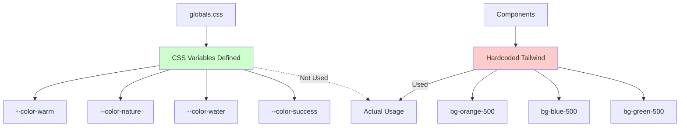
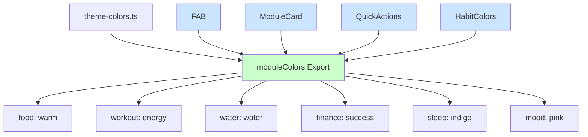

# UI/UX Анализ и Рекомендации по Улучшению

## Краткий Обзор Проекта

Проект **Life OS** — это комплексное веб-приложение для управления личной жизнью (аналог Notion для личных данных), построенное на:

- Next.js 14 с App Router
- Dexie.js (IndexedDB) для локального хранения
- shadcn/ui как база UI компонентов
- Tailwind CSS v4 для стилизации
- next-intl для интернационализации (RU/EN)

---

## Текущее Состояние Дизайн-Системы

### ✅ Что уже сделано хорошо

1. **Глобальная система дизайн-токенов** в [`globals.css`](src/app/[locale]/globals.css:46):
   - Полная цветовая палитра на основе OKLCH (light/dark mode)
   - Кастомные акцентные цвета: `--color-warm`, `--color-nature`, `--color-energy`, `--color-water`, `--color-success`, `--color-warning`
   - Градиенты: `--gradient-primary`, `--gradient-warm`, `--gradient-nature`, `--gradient-water`
   - Типографика: `--font-display`, `--font-body`, `--font-mono`
   - Тени: `--shadow-sm`, `--shadow-md`, `--shadow-lg`, `--shadow-xl`, glow-варианты
   - Анимации: `--duration-fast`, `--duration-normal`, `--ease-default`, `--ease-bounce`

2. **UI Компонентная библиотека** в [`src/components/ui/`](src/components/ui/badge.tsx:1):
   - Badge, Button, Card, Dialog, Input, Tabs, Calendar, Combobox, Popover и др.
   - Storybook документация (Badge.stories.tsx, Button.stories.tsx и т.д.)
   - Полная поддержка dark mode

3. **Адаптивный дизайн**:
   - Mobile-first подход
   - Bottom navigation на мобильных
   - Side navigation на десктопе
   - Грамотное использование breakpoints

---

## ❌ Выявленные Проблемы с Единообразием

### 1. Несогласованность Цветовой Системы

**Проблема:** Дизайн-токены существуют, но **практически не используются**. Вместо них повсеместно используются hardcoded Tailwind классы.

| Где определяется                       | Где используется |
| -------------------------------------- | ---------------- |
| `--color-warm: oklch(0.7 0.15 45)`     | Почти НИГДЕ      |
| `--color-nature: oklch(0.65 0.18 160)` | Почти НИГДЕ      |
| `--color-water: oklch(0.7 0.16 220)`   | Почти НИГДЕ      |
| `--color-success: oklch(0.6 0.18 145)` | Редко            |

**Примеры несогласованности:**

```tsx
// ❌ В page.tsx (home) - hardcoded цвета
{ color: "text-orange-500", bgColor: "bg-orange-500/10" }

// ✅ Должно быть
{ color: "text-[--color-warm]", bgColor: "bg-[--color-warm-light]" }

// ❌ В habits/page.tsx - несогласованные цвета привычек
const habitColors = [
  { bg: "bg-red-500/10", text: "text-red-500" },
  { bg: "bg-orange-500/10", text: "text-orange-500" },
  // ... и т.д.
]

// ❌ В fab.tsx - разные цвета для разных типов
{ color: "bg-orange-500" }  // food
{ color: "bg-purple-500" }   // workout
{ color: "bg-green-500" }     // finance
{ color: "bg-blue-500" }     // water
{ color: "bg-indigo-500" }   // sleep
```

### 2. Отсутствие Единой Типографики

**Проблема:** Переменные `--font-display` и `--font-body` определены, но не применяются системно.

```tsx
// ❌ В side-nav.tsx
<h1 className="text-xl font-bold ...">

// ✅ Должно быть
<h1 className="text-xl font-bold font-[family-name:var(--font-display)] ...">
```

### 3. Непоследовательность Border Radius

**Проблема:** Где-то используется `rounded-xl`, где-то `rounded-2xl`, где-то `rounded-3xl`, где-то `rounded-none`.

```tsx
// В разных местах:
// rounded-xl
// rounded-2xl
// rounded-3xl
// rounded-full

// ✅ Должно быть:
// Использовать CSS переменную --radius-lg или Tailwind классы:
// rounded-lg (соответствует --radius-lg: var(--radius))
```

### 4. Разные паттерны отступов (spacing)

- В одних местаpxх `-4`, в других `px-6`
- `py-4` vs `py-6` vs `py-8`
- Нет стандартных "карточных" отступов

### 5. Неединообразные Card Styles

```tsx
// В разных компонентах:
<Card className="rounded-xl p-4">...</Card>
<Card className="rounded-2xl p-6">...</Card>
<Card className="rounded-none border-0 shadow-none">...</Card>
```

---

## 📋 Рекомендации по Улучшению

### Приоритет 1: Создание Centralized Color Token System

**Создать файл** `src/lib/theme-colors.ts`:

```typescript
// Цветовая схема для модулей приложения
export const moduleColors = {
  food: {
    light: "bg-[--color-warm-light]",
    DEFAULT: "bg-[--color-warm]",
    text: "text-[--color-warm]",
    border: "border-[--color-warm]/30",
    shadow: "shadow-[--shadow-glow-warm]",
  },
  workout: {
    light: "bg-[--color-energy-light]",
    DEFAULT: "bg-[--color-energy]",
    text: "text-[--color-energy]",
    border: "border-[--color-energy]/30",
    shadow: "shadow-[--shadow-glow-energy]",
  },
  water: {
    light: "bg-[--color-water-light]",
    DEFAULT: "bg-[--color-water]",
    text: "text-[--color-water]",
    border: "border-[--color-water]/30",
    shadow: "shadow-[--shadow-glow-water]",
  },
  finance: {
    light: "bg-[--color-success-light]",
    DEFAULT: "bg-[--color-success]",
    text: "text-[--color-success]",
    border: "border-[--color-success]/30",
    shadow: "shadow-[--shadow-glow-success]",
  },
  sleep: {
    light: "bg-indigo-500/10", // или добавить в CSS
    DEFAULT: "bg-indigo-500",
    text: "text-indigo-500",
    border: "border-indigo-500/30",
  },
  mood: {
    light: "bg-pink-500/10",
    DEFAULT: "bg-pink-500",
    text: "text-pink-500",
  },
} as const
```

### Приоритет 2: Создание UI Composition Components

**Создать** `src/components/ui/module-card.tsx`:

```tsx
interface ModuleCardProps {
  module: keyof typeof moduleColors
  icon: React.ReactNode
  title: string
  subtitle?: string
  href?: string
  onClick?: () => void
  children?: React.ReactNode
}

export function ModuleCard({
  module,
  icon,
  title,
  subtitle,
  href,
  onClick,
  children,
}: ModuleCardProps) {
  const colors = moduleColors[module]

  const content = (
    <Card
      className={cn(
        "transition-all duration-200 hover:scale-[1.02] hover:shadow-lg",
        colors.light,
        "border-transparent hover:border-[--border]"
      )}
    >
      <CardContent className="p-4 flex items-center gap-4">
        <div className={cn("p-3 rounded-xl", colors.DEFAULT, "text-white")}>{icon}</div>
        <div className="flex-1">
          <h3 className={cn("font-semibold", colors.text)}>{title}</h3>
          {subtitle && <p className="text-sm text-muted-foreground">{subtitle}</p>}
        </div>
        {children}
      </CardContent>
    </Card>
  )

  return href ? <Link href={href}>{content}</Link> : <div onClick={onClick}>{content}</div>
}
```

### Приоритет 3: Унификация Списка Привычек (Habits)

**Обновить** `src/app/[locale]/habits/page.tsx`:

```tsx
// Вместо hardcoded цветов:
const habitColors = [
  { bg: "bg-red-500/10", text: "text-red-500", name: "Красный" },
  { bg: "bg-orange-500/10", text: "text-orange-500", name: "Оранжевый" },
  // ...
]

// Использовать модульную систему или отдельный набор:
const standardizedHabitColors = [
  { bg: "bg-[--color-destructive]", light: "bg-[--destructive]/10", text: "text-[--destructive]" },
  { bg: "bg-[--color-warm]", light: "bg-[--color-warm-light]", text: "text-[--color-warm]" },
  { bg: "bg-yellow-500", light: "bg-yellow-500/10", text: "text-yellow-600" },
  {
    bg: "bg-[--color-success]",
    light: "bg-[--color-success-light]",
    text: "text-[--color-success]",
  },
  { bg: "bg-[--color-water]", light: "bg-[--color-water-light]", text: "text-[--color-water]" },
  { bg: "bg-[--color-energy]", light: "bg-[--color-energy-light]", text: "text-[--color-energy]" },
  { bg: "bg-pink-500", light: "bg-pink-500/10", text: "text-pink-500" },
]
```

### Приоритет 4: Стандартизация Компонентов Формы

**Создать** `src/components/ui/module-form.tsx`:

```tsx
interface ModuleFormFieldProps {
  module: ModuleType
  label: string
  icon?: React.ReactNode
}

export function ModuleFormField({ module, label, icon }: ModuleFormFieldProps) {
  const colors = moduleColors[module]
  return (
    <div className={cn("space-y-2", colors.light, "p-4 rounded-xl")}>
      <Label className={colors.text}>
        {icon && <span className="mr-2">{icon}</span>}
        {label}
      </Label>
      {/* children */}
    </div>
  )
}
```

### Приоритет 5: Добавить Недостающие Дизайн-Токены

**Расширить** `src/app/[locale]/globals.css`:

```css
:root {
  /* Добавить недостающие акцентные цвета */
  --color-sleep: oklch(0.6 0.18 265);
  --color-sleep-light: oklch(0.85 0.12 265);
  --color-mood: oklch(0.65 0.18 330);
  --color-mood-light: oklch(0.85 0.15 330);

  /* Добавить variants для нейтральных */
  --color-slate: oklch(0.55 0.02 250);
  --color-slate-light: oklch(0.97 0.01 250);
}
```

---

## 🎯 Дополнительные UI/UX Улучшения

### Micro-interactions

1. **Кнопки:**
   - Добавить `transition-all duration-200` на все интерактивные элементы
   - Добавить subtle scale на hover: `hover:scale-[1.02]`

2. **Карточки:**
   - Добавить hover states с легким подъемом: `hover:-translate-y-0.5 hover:shadow-lg`

3. **Navigation:**
   - Активный элемент: `bg-primary/10` + subtle glow
   - Hover: плавное изменение фона `transition-colors`

### Визуальная Иерархия

1. **Типографика:**
   - Page titles: `text-2xl font-bold font-[family-name:var(--font-display)]`
   - Section headers: `text-lg font-semibold`
   - Body: `text-sm text-muted-foreground`

2. **Spacing System:**
   - Container: `max-w-4xl mx-auto px-4`
   - Section gap: `space-y-6`
   - Card padding: `p-4` (small), `p-6` (medium), `p-8` (large)

### Dark Mode Улучшения

1. Добавить цветовые акценты для dark mode (уже частично есть в `globals.css:142-153`)
2. Добавить `dark:bg-[--color-*]` варианты для карточек
3. Проверить контрастность в dark mode

### Доступность (A11y)

1. Добавить `aria-label` на все иконки без текста
2. Проверить color contrast для кастомных цветов
3. Добавить `focus-visible` states

---

## 📝 План Внедрения

### Phase 1: Foundation (1-2 дня)

- [ ] Создать `src/lib/theme-colors.ts` с модульной системой цветов
- [ ] Обновить CSS переменные (добавить недостающие)
- [ ] Создать базовые composition компоненты

### Phase 2: Component Migration (2-3 дня)

- [ ] Обновить FAB для использования theme colors
- [ ] Обновить страницу привычек (habits)
- [ ] Обновитьquick action cards на главной
- [ ] Обновить все формы логов

### Phase 3: Polish (1-2 дня)

- [ ] Добавить统一的 hover/transition states
- [ ] Проверить dark mode
- [ ] Добавить недостающие aria-labels

---

## 📊 Mermaid: Текущее Состояние Color System



---

## 📊 Mermaid: Target State



---

## Заключение

Проект имеет **отличную техническую базу** — полная система дизайн-токенов уже существует в CSS. Основная проблема — **отсутствие консистентности** в использовании этих токенов.

**Ключевые действия:**

1. Создать централизованную систему цветов для модулей
2. Постепенно мигрировать компоненты на использование CSS переменных
3. Создать composition components для типичных паттернов
4. Добавить documentation/guidelines для команды

**Ожидаемый результат:**

- Единообразный визуальный язык
- Легкая смена темы
- Проще поддержка и развитие
- Лучший UX для пользователей
